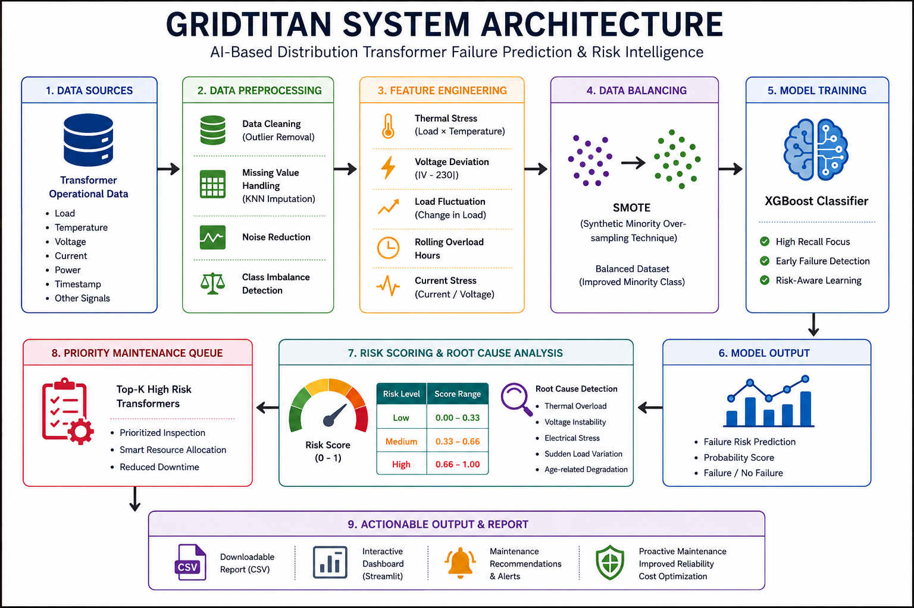

# ⚡ GRIDTITAN — Data-Centric AI System for Distribution Transformer Risk Intelligence

## 🏆 Overview

Distribution transformers are critical components in electrical power distribution networks. Unexpected transformer failures can lead to:

- ⚠️ Power outages  
- ⚠️ Equipment damage  
- ⚠️ Increased maintenance costs  
- ⚠️ Industrial and agricultural disruptions  

Traditional maintenance systems are mostly **reactive**, where failures are identified only after faults occur.

GRIDTITAN presents a **data-centric AI-powered transformer risk intelligence system** designed to:

✅ Predict transformer failure risk  
✅ Identify probable root causes  
✅ Prioritize high-risk transformers  
✅ Enable proactive maintenance planning  

---

# 🎯 Problem Statement

Develop an intelligent transformer monitoring and risk prediction system capable of handling real-world operational challenges such as:

- Missing sensor values  
- Rare failure events  
- Noisy electrical signals  
- Voltage instability  
- Thermal overload conditions  

The objective is to improve early failure detection and reduce unexpected transformer breakdowns.

---

# 💡 Core Idea

> **We improved the data, not just the model.**

Instead of relying only on complex machine learning models, the project follows a **data-centric AI approach** focused on:

- Improving data quality  
- Engineering realistic operational features  
- Handling imbalance effectively  
- Generating actionable maintenance decisions 

---

# ⚡ Transformer Focus

The proposed system primarily focuses on:

## ✅ Distribution Transformers

Failure scenarios considered:

- Thermal Overload  
- Voltage Instability  
- Electrical Stress  
- Sudden Load Variation  
- Age-related Degradation  

---

# 📊 Ultra-Realistic Dataset

A highly realistic synthetic dataset was generated to simulate real-world transformer operating conditions.

## 🔹 Dataset Characteristics

- Time-based operational patterns  
- Seasonal stress behavior  
- Voltage fluctuation scenarios  
- Agricultural load patterns  
- Rolling overload duration  
- Thermal stress accumulation  
- Sensor noise simulation  
- Missing sensor values  
- Root-cause labels  
- Class imbalance conditions  

---

# 📌 Dataset Features

| Feature | Description |
|---|---|
| load | Transformer load condition |
| temperature | Operating temperature |
| voltage | Voltage behavior |
| current | Current flow |
| power | Power consumption |
| thermal_stress | Load × temperature stress |
| voltage_deviation | Voltage instability indicator |
| current_stress | Electrical stress level |
| load_fluctuation | Sudden operational variation |
| rolling_thermal_stress | Accumulated thermal degradation |
| rolling_overload_hours | Overload duration tracking |

---

# 🧠 Field Insights & Domain Knowledge

The system design was inspired by real-world observations from electrical field personnel and maintenance workers.

## Key Insights

- Load spikes increase transformer overheating risk  
- Voltage fluctuations stress transformer insulation  
- Failures occur gradually due to long-term degradation  
- Reactive maintenance delays fault identification  
- Agricultural motor usage causes unstable load behavior  

These insights directly influenced:

✅ Feature engineering  
✅ Failure logic  
✅ Risk scoring strategy  
✅ Root-cause analysis  

---

# ⚠️ Baseline Model Analysis

## Baseline Model
- Logistic Regression

## Baseline Performance

| Metric | Value |
|---|---|
| Accuracy | 94% |
| Recall | 0 |

## Why Recall Became 0?

The dataset contains very limited failure cases compared to normal operating conditions.

As a result:

- The baseline model became biased toward the majority class  
- Most samples were predicted as “Normal”  
- No transformer failures were detected  

This demonstrates that:

> **High accuracy alone is misleading in rare-event prediction problems.**

---

# 🔧 Data-Centric Improvements

## 1️⃣ Advanced Missing Value Handling
- KNN Imputation

## 2️⃣ Feature Engineering
Created realistic transformer degradation indicators:

- Thermal Stress  
- Voltage Deviation  
- Load Fluctuation  
- Current Stress  
- Rolling Overload Hours  

## 3️⃣ Imbalance Handling
- SMOTE applied for balancing failure classes

## 4️⃣ Recall-Focused Prediction Strategy
Prioritized early failure detection over maximizing accuracy.

---

# 🤖 Improved AI Model

## Final Model
- XGBoost Classifier

---

# 📈 Performance Comparison

| Metric | Baseline | Improved |
|---|---|---|
| Accuracy | 94% | ~89% |
| Recall | 0 | **~91%** 🔥 |

## Key Achievement

> 🚀 Recall improved from **0 → 91%**, enabling effective early transformer failure detection.

---

# ⚙️ Engineering Strategy

In power distribution systems:

> Missing a transformer failure is more dangerous than generating a false alarm.

Therefore, the system prioritizes:

✅ High Recall  
✅ Early Warning  
✅ Failure Prevention  

instead of focusing only on accuracy.

---

# 🏗️ System Architecture

```text
Input Data
   ↓
Data Cleaning
   ↓
KNN Missing Value Handling
   ↓
Feature Engineering
   ↓
SMOTE Balancing
   ↓
XGBoost Model
   ↓
Risk Scoring
   ↓
Root Cause Analysis
   ↓
Priority Maintenance Queue
```

---

# 🚨 Intelligent Risk Output

Each transformer receives:

- Risk Score (0–1)
- Risk Level
- Root Cause
- Maintenance Recommendation

---

# 🔍 Root Cause Identification

The system identifies probable transformer failure causes such as:

- Thermal Overload  
- Voltage Instability  
- Electrical Stress  
- Sudden Load Variation  
- Age-related Degradation  

---

# 🛠️ Maintenance Intelligence

The model generates:

## ✅ Priority Maintenance Queue

Top high-risk transformers are automatically ranked for inspection.

## ✅ Maintenance Recommendations

Examples:

- Immediate inspection required  
- Monitor closely  
- Stable condition  

---

# 📥 Downloadable Output

The system generates a downloadable maintenance report containing:

- Transformer ID  
- Risk Score  
- Risk Level  
- Root Cause  
- Maintenance Action  

---

# 🌍 Real-World Impact

GRIDTITAN supports:

✅ Predictive Maintenance  
✅ Reduced Unexpected Failures  
✅ Improved Grid Reliability  
✅ Faster Fault Identification  
✅ Smarter Resource Allocation  
✅ Reduced Operational Downtime  

The system transforms maintenance strategy from:

> ❌ Reactive Maintenance  
➡️  
> ✅ Proactive AI-driven Maintenance

---

# 🏆 Why GRIDTITAN Stands Out

✅ Data-centric AI approach  
✅ Root-cause-aware risk prediction  
✅ Realistic industrial dataset simulation  
✅ Recall-focused engineering strategy  
✅ Actionable maintenance intelligence  
✅ Explainable AI-driven decision support  
✅ Scalable for smart grid systems  

---

# 🛠️ Technology Stack

- Python  
- Pandas  
- NumPy  
- Scikit-learn  
- XGBoost  
- Imbalanced-learn (SMOTE)  
- Streamlit  
- Matplotlib  

---

# 📂 Repository Structure

```text
Transformer-Failure-Prediction/
│
├── dataset/
│   ├── Ultra_Realistic_Distribution_Transformer_Dataset_Sample.csv
│   └── High_Load_Stress_Transformer_Dataset.csv
│
├── notebooks/
│   └── GRIDTITAN_Distribution_Transformer_Risk_System.ipynb
│
├── output/
│   └── risk_ranked_transformers.csv
│
├── app.py
├── requirements.txt
├── README.md
│
└── assets/
    ├── architecture.png
    ├── flowchart.png
    └── demo_screenshot.png
```

---

# 🚀 Streamlit Deployment

## Live Demo

🔗 Streamlit App:  
https://transformer-failure-prediction-deploy-sss.streamlit.app/

---

# 📁 Additional Resources

📁 Google Drive:  
https://drive.google.com/drive/folders/1q3_BGpidGtf__45evzSvcqyOmcIxs_dP

💻 GitHub Repository:  
https://github.com/s-s-shriram/Transformer-Failure-Prediction/

---

# 👨‍💻 Author

## S.S.SHRIRAM
B.Tech Artificial Intelligence & Data Science

---

# 🔥 Final Note

> “GRIDTITAN transforms transformer operational data into actionable maintenance intelligence using data-centric AI.”

> “From reactive maintenance to proactive transformer risk intelligence.”
